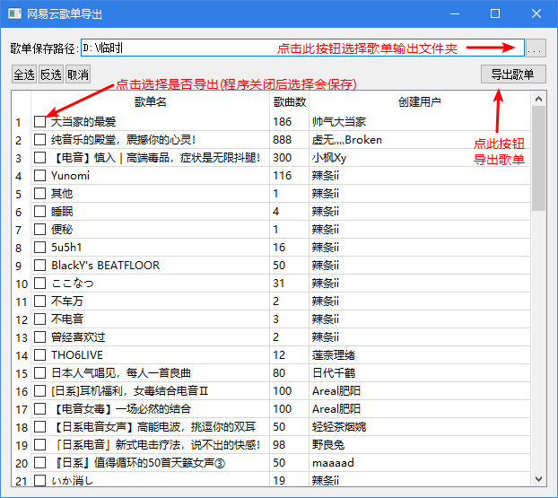

# 导出网易云歌单为m3u

此此分支是GUI版本,正在开发中\
由于刚学Pyside2(Qt),所以是在边学边开发\
希望2.12号(开学)之前能搞定并且并入主分支

**_适用于Windows_**

#### 此程序可以分析网易云客户端的数据库文件
#### 然后导出播放列表为m3u格式

此程序需要网易云的配置文件处于默认目录\
可能将来会做手动选择网易云数据库文件目录的功能\
如果安装的时候没有动过配置文件目录就没事（和安装目录没有关系，即使安装在D盘也许也行）

## 依赖库:
非GUI版本没有依赖库

GUI版本依赖库:
    
    Pyside2 (pip install pyside2)

## 使用方法(非GUI版本)

首先打开程序后会开始自动分析网易云客户端数据库文件

然后直到出现这段文字，就可以开始进行筛选了。

    请输入筛选模式，1代表按照用户id筛选，2代表按照是否是自己的歌单筛选:

分析完毕的播放列表可以按照两种模式进行筛选导出

### 1.按照用户id来筛选

打开脚本后输入1即是此模式

回车之后输入歌单创建者的网易云用户id即可只导出此用户创建的歌单

#### 特别的：在此模式下不输入任何用户id直接回车就是导出全部歌单

### 2.按照是否是自己创建的播放列表来进行筛选

打开脚本后输入2即是此模式

回车之后输入1就是导出自己创建的歌单

输入2就是导出收藏的别人创建的歌单

## 使用方法(GUI版本)

## TODO：

- [x] 基础的导出网易云歌单功能
- [x] 按照用户id筛选
- [x] 按照是否是自己创建的歌单筛选
- [x] 简单的GUI
    - [x] 自定义输出播放列表文件目录
    - [x] 图形化选择输出的歌单
    - [ ] 画个/找个图标
    - [ ] 更加漂亮的界面
    - [ ] 